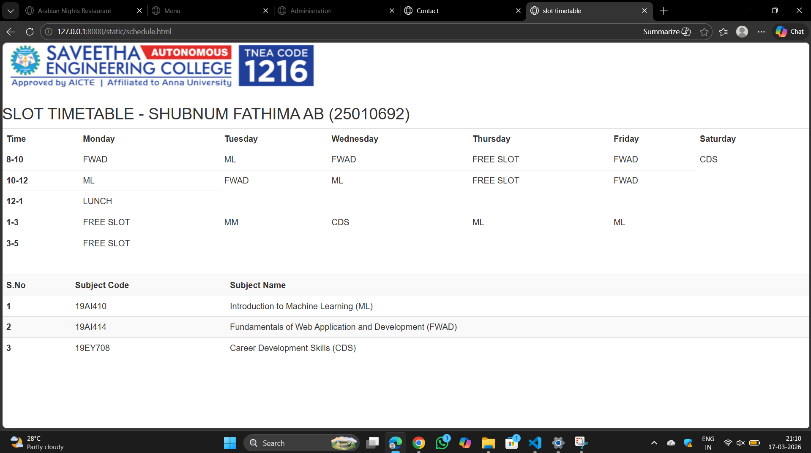

# Ex08 CAMU Schedule using Bootstrap
## Date:
17/03/2026
## AIM:
To design a responsive and visually appealing CAMU Schedule using Bootstrap.

## DESIGN STEPS:

### Step 1:
Clone the repository from GitHub.

### Step 2:
Create Django Admin project.

### Step 3:
Create a New App under the Django Admin project.

### Step 4:
Add the Bootstrap CDN link inside the ```<head>``` section.

### Step 5:
Insert a table element with Bootstrap table classes.

### Step 6:
Construct the complete table.

### Step 7:
Add a header/footer displaying copyright information.

### Step 8:
Publish the website in the LocalHost.

## PROGRAM :
```
<html>
    <head>
        <link rel="stylesheet" href="https://maxcdn.bootstrapcdn.com/bootstrap/3.4.1/css/bootstrap.min.css">
  <script src="https://ajax.googleapis.com/ajax/libs/jquery/3.7.1/jquery.min.js"></script>
  <script src="https://maxcdn.bootstrapcdn.com/bootstrap/3.4.1/js/bootstrap.min.js"></script>
        <title>slot timetable</title>
    </head>

    <body>
        
        <br>
        <h2>SLOT TIMETABLE - SHUBNUM FATHIMA AB (25010692)</h1>
        <table class="table">
            <tr>
                <th>Time</th>
                <th>Monday</th>
                <th>Tuesday</th>
                <th>Wednesday</th>
                <th>Thursday</th>
                <th>Friday</th>
                <th>Saturday</th>
            </tr>
            <tr>
                <th>8-10</th>
                <td>FWAD</td>
                <td>ML</td>
                <td>FWAD</td>
                <td>FREE SLOT</td>
                <td>FWAD</td>
                <td>CDS</td>
            </tr>
            <tr>
                <th>10-12</th>
                <td>ML</td>
                <td>FWAD</td>
                <td>ML</td>
                <td>FREE SLOT</td>
                <td>FWAD</td>
            </tr>
            <tr>
                <th>12-1</th>
                <td>LUNCH</td>
            </tr>
            <tr>
                <th>1-3</th>
                <td>FREE SLOT</th>
                <td>MM</td>
                <td>CDS</td>
                <td>ML</td>
                <td>ML</td>
            </tr>
            <tr>
                <th>3-5</th>
                <td>FREE SLOT</td>
            </tr>
        </table>
        <br>
        <table class="table table-striped">
            <tr>
                <th>S.No</th>
                <th>Subject Code</th>
                <th>Subject Name</th>
            </tr>
            <tr>
                <th>1</th>
                <td>19AI410</td>
                <td>Introduction to Machine Learning (ML)</td>
            </tr>
            <tr>
                <th>2</th>
                <td>19AI414</td>
                <td>Fundamentals of Web Application and Development (FWAD)</td>
            </tr>
            <tr>
                <th>3</th>
                <td>19EY708</td>
                <td>Career Development Skills (CDS)</td>
            </tr>
        </table>
           
    </body>
</html>

```

## OUTPUT:


## RESULT:
A responsive and visually appealing CAMU Schedule web page using Bootstrap is designed successfully.
